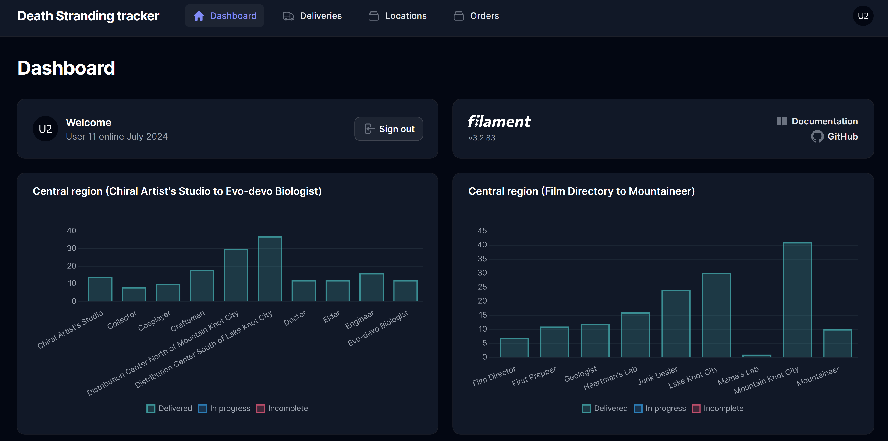

# Death Stranding tracker

Progress tracker for Death Stranding



## Purpose

The purpose of the death standing tracker is to track all deliveries with the aim to help make all 540 in the game!

Once setup login to the (https://stranding.test/app) using the seeded user **user@example.com** and password 
**password**.

### Dashboard

The dashboard displays graphs for every location in the game. This makes it easier to identify locations to target, such
as locations with a low delivery count. Later in the game its easy to identify locations with orders and complete
locations.

### Deliveries

If any mistakes are made while taking an order the delivery can be edited. It is best to search by order number.

### Locations

When making multiple deliveries or collections from a location it can be useful to search by location and then switch
between deliveries to and from the location.

### Orders

This is the main screen to search, take and make deliveries by order. Orders can also be taken and made in bulk using the 

----

## Packages

The following packages and plugins have been used:

- [Filament PHP](https://filamentphp.com/docs) v3 - The perfect starting point for your next app.

### Dev Tooling

- [PHPUnit](https://docs.phpunit.de/en/10.3/) v10 - PHPUnit provides a framework for writing tests as well as a
  command-line tool for running these tests. PHPUnit is installed by default with Laravel.

## Requirements

This is a Laravel 10 project. The requirements are the same as a
new [Laravel 10 project](https://laravel.com/docs/10.x).

- [PHP 8.1+](https://www.php.net/downloads.php)
- [Composer](https://getcomposer.org)
- [Node](https://nodejs.org/en/download)

Recommended:

- [Git](https://git-scm.com/downloads)

## Clone

Clone the project repository.

e.g.

```sh
git clone git@github.com:Pen-y-Fan/stranding.git
```

## Install

Install all the dependencies using composer.

```sh
cd stranding
composer install
```

## Create .env

Create an `.env` file from `.env.example`

```shell script
cp .env.example .env
```

## Configure Laravel

This project uses models and seeders to generate the tables for the database. Tests will use the seeded data. Configure
the Laravel **.env** file with the **database**, updating **username** and**password** as per you local setup.

```text
APP_NAME="Death Stranding tracker"

APP_URL=https://stranding.test

DB_CONNECTION=mysql
DB_HOST=127.0.0.1
DB_PORT=3306
DB_DATABASE=stranding
DB_USERNAME=YourDatabaseUserName (root)
DB_PASSWORD=YourDatabaseUserPassword
```

## Generate APP_KEY

Generate an APP_KEY using the artisan command

```shell script
php artisan key:generate
```

## Create the database

The database will need to be manually created e.g.

```shell
mysql -u YourDatabaseUserName (root)
CREATE DATABASE stranding CHARACTER SET utf8mb4 COLLATE utf8mb4_unicode_ci;
exit
```

## Install Database

This project uses models and seeders to generate the tables for the database. Tests will use the seeded data.

```shell
php artisan migrate --seed
# or if previously migrated: 
php artisan migrate:fresh --seed 
```

The seeder will populate:

- Users (2): admin@example.com & user@example.com
- Districts (3): Western, Central and Eastern
- Locations (40): All the delivery locations in East and Central. From Capital Knot City to Wind Farm
    - also locations for deliveries In progress and Other (e.g. a Pill box or private room)
- DeliveryCategories (4): Delivery Time, Delivery Volume, Cargo Condition and Miscellaneous
- Orders (540) - all the standard orders, which count towards game completion

To generate 20 test deliveries run:

```shell
php artisan db:seed DeliverySeeder
```

This can be run multiple times, as required.

## Vite

The first time you pull the project run install:

```shell
npm install
```

Compile your CSS / JavaScript for development and recompile on change:

```shell
npm run dev
```

When ready to deploy, compile your CSS / JavaScript for production:

```shell
npm run build
```

## Run tests

Tests have been configured to use **sqlite** in memory database, enable the PHP **pdo_sqlite** extension or adjust
**phpunit.xml** if MySQL is preferred. To make it easy to run all the PHPUnit tests a composer script has been created
in **composer.json**. From the root of the projects, run:

```shell script
composer tests
```

You should see the results in testDoc format:

```text
PHPUnit 10.3.3 by Sebastian Bergmann and contributors.

Runtime:       PHP 8.1.16
Configuration: F:\laragon\www\stranding\phpunit.xml

.......................................                           39 / 39 (100%)

Time: 00:01.599, Memory: 54.00 MB

OK (39 tests, 214 assertions)
```

## Contributing

This is a **personal project**. Contributions are **not** required. Anyone interested in developing this project are
welcome to fork or clone for your own use.

## Credits

- [Michael Pritchard \(AKA Pen-y-Fan\)](https://github.com/pen-y-fan) original project

## License

MIT License (MIT). Please see [License File](LICENSE.md) for more information.

The order data has been copied from
the [Death stranding wiki](https://deathstranding.fandom.com/wiki/Orders) and is available under
the [CC BY-SA](https://www.fandom.com/licensing) license.  
